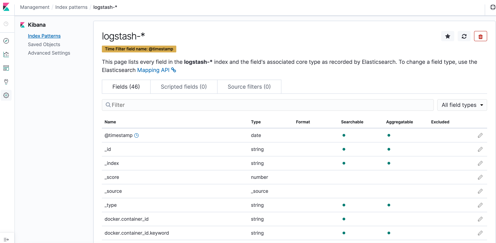

# efk-kind-allinone

Install EFK (ElasticSearch Fluentd Kibana) Stack for Kind Cluster
## Create a new Kind Cluster

```bash
cat << EOF | >> kind.yaml
kind: Cluster
apiVersion: kind.x-k8s.io/v1alpha4
nodes:
- role: control-plane
  image: kindest/node:v1.21.14@sha256:ad5b7446dd8332439f22a1efdac73670f0da158c00f0a70b45716e7ef3fae20b 
- role: worker
  image: kindest/node:v1.21.14@sha256:ad5b7446dd8332439f22a1efdac73670f0da158c00f0a70b45716e7ef3fae20b
- role: worker
  image: kindest/node:v1.21.14@sha256:ad5b7446dd8332439f22a1efdac73670f0da158c00f0a70b45716e7ef3fae20b
- role: worker
  image: kindest/node:v1.21.14@sha256:ad5b7446dd8332439f22a1efdac73670f0da158c00f0a70b45716e7ef3fae20b
EOF

kind create cluster --config kind.yaml
```

## Install EFK Stack

```bash
kubectl apply -f https://raw.githubusercontent.com/SataQiu/efk-kind-allinone/main/allinone.yaml
```

## Enjoy with Kibana Dashboard

```bash
kubectl port-forward svc/kibana-logging -n kube-system 5601
```

Open a browser to access http://localhost:5601/

